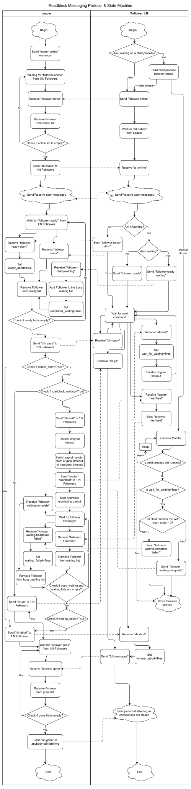

# roadblock
[](https://github.com/perftool-incubator/roadblock/actions)

A synchronization services tool

## Introduction
Roadblock provides synchronization services for multiple lines of execution, most likely in a distributed system (systems, virtual machines, containers, etc.).  A centralized Redis server is used to provide communication services between a single 'leader' and one or more 'followers'.  The 'leader' is responsible for ensuring that all members of the roadblock have reached a common state (ie. 'ready') before releasing them with a 'go' command.  Each member confirms it's receipt of the 'go' command by responding with a 'gone' command before proceeding.

## Usage
```
./roadblocker.py --role <leader|follower> --redis-server <host:port> \
    --roadblock-id <id> --follower-id <id> --timeout <seconds> \
    [--message-log <file>] [--user-messages <file>] [--wait-for <script>]
```

## Return Codes
| Code | Meaning |
|------|---------|
| 0 | Successful synchronization |
| 1 | General error |
| 2 | Invalid input |
| 3 | Barrier timeout |
| 4 | Abort (single SIGINT) |
| 5 | Heartbeat timeout (wait-for) |
| 6 | Abort while waiting (wait-for) |

## Testing
Build the test container and run the test suite:
```
sudo ./test/build-container.sh
sudo ./test/run-test.sh --followers 5
```

The test harness supports 9 scenarios including basic synchronization, timeout handling, abort, wait-for patterns, heartbeat timeout, and SIGINT handling.

## Documentation

### Protocol


