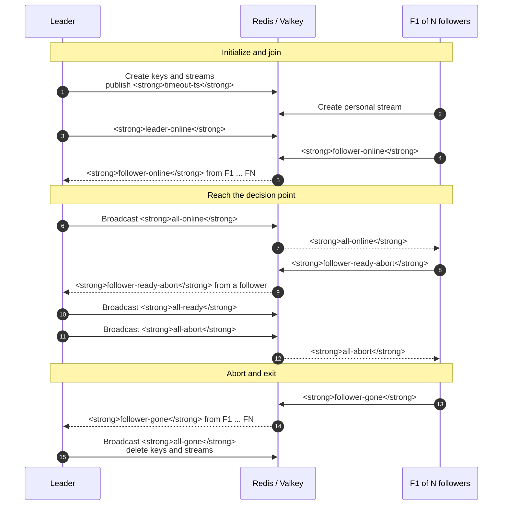

# Abort invocation path

This focused view shows a follower reporting an error before the barrier is
released. The leader propagates the abort, and all followers still complete
the gone handshake.

