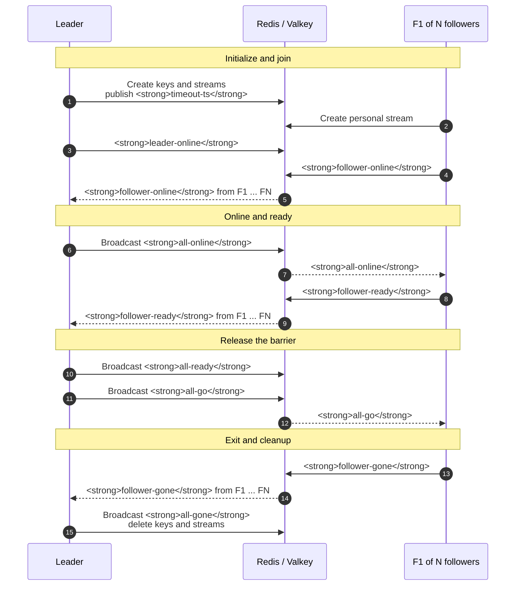

# Normal invocation path

This focused view shows the successful path for one leader and one of `N`
followers. Redis/Valkey carries every protocol message.

```mermaid
%%{init: {"sequence": {"useMaxWidth": true}}}%%
sequenceDiagram
    autonumber
    participant L as Leader
    participant R as Redis / Valkey
    participant F as F1 of N followers

    Note over L,F: Initialize and join
    L->>R: Create keys and streams<br/>publish <strong>timeout-ts</strong>
    F->>R: Create personal stream
    L->>R: <strong>leader-online</strong>
    F->>R: <strong>follower-online</strong>
    R-->>L: <strong>follower-online</strong> from F1 ... FN

    Note over L,F: Online and ready
    L->>R: Broadcast <strong>all-online</strong>
    R-->>F: <strong>all-online</strong>
    F->>R: <strong>follower-ready</strong>
    R-->>L: <strong>follower-ready</strong> from F1 ... FN

    Note over L,F: Release the barrier
    L->>R: Broadcast <strong>all-ready</strong>
    L->>R: Broadcast <strong>all-go</strong>
    R-->>F: <strong>all-go</strong>

    Note over L,F: Exit and cleanup
    F->>R: <strong>follower-gone</strong>
    R-->>L: <strong>follower-gone</strong> from F1 ... FN
    L->>R: Broadcast <strong>all-gone</strong><br/>delete keys and streams
```
