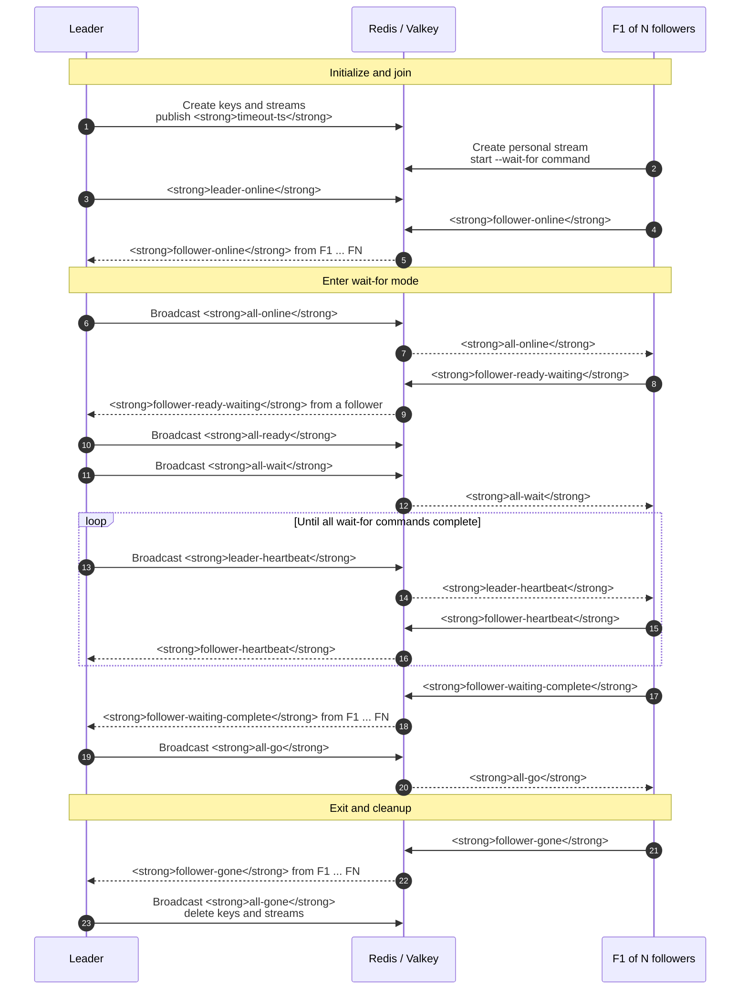

# Wait-for invocation path

This focused view shows the optional `--wait-for` path. The leader replaces
the fixed barrier timeout with heartbeat monitoring until the follower's
long-running operation completes.

