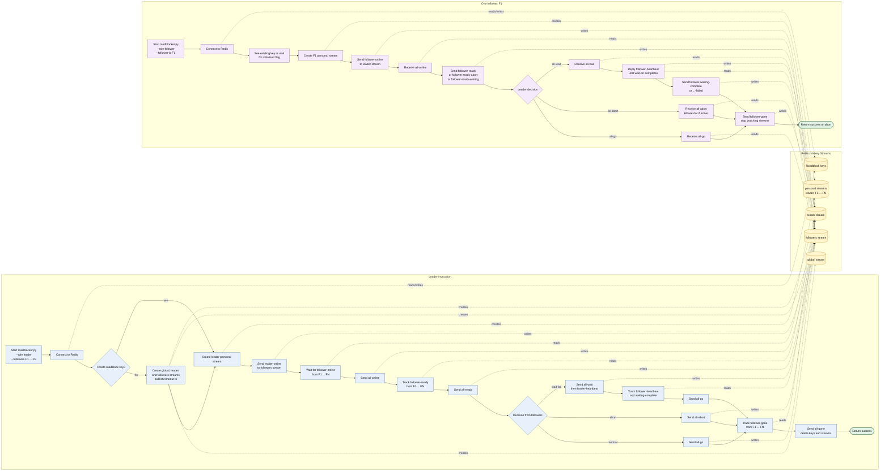

# Typical roadblock invocation

This sequence shows one normal barrier invocation with one leader and one of
the `N` followers. The other followers perform the same follower-side steps
in parallel. Redis Streams carry the messages; the leader consumes its leader
and personal streams, while each follower consumes the global, followers, and
personal streams.

