# Roadblock state machine

This chart shows the lifecycle of one roadblock barrier. The leader tracks
the corresponding state of all expected followers; a follower follows the
same protocol from its own perspective.

```mermaid
%%{init: {"flowchart": {"useMaxWidth": true, "htmlLabels": true}}}%%
flowchart TD
    START([Invocation starts]) --> INIT

    subgraph Setup[Initialization]
        INIT[Connect to Redis<br/>and configure timeout]
        INIT --> CLAIM{Roadblock key exists?}
        CLAIM -- No --> CREATE[Initiator creates Redis keys<br/>and streams<br/>publishes <strong>timeout-ts</strong><br/>and initiator info]
        CLAIM -- Yes --> WAIT_INIT[Wait for<br/>initialized flag]
        CREATE --> STREAMS[Create personal<br/>stream]
        WAIT_INIT --> STREAMS
    end

    STREAMS --> ONLINE
    ONLINE[<strong>Online</strong><br/>Follower: <strong>follower-online</strong><br/>Leader: <strong>leader-online</strong>]
    ONLINE --> ALL_ONLINE{Leader received<br/><strong>follower-online</strong><br/>from all N?}
    ALL_ONLINE -- No --> ONLINE
    ALL_ONLINE -- Yes --> BROADCAST_ONLINE[Leader broadcasts<br/><strong>all-online</strong>]
    BROADCAST_ONLINE --> READY

    READY[<strong>Ready</strong><br/><strong>follower-ready</strong><br/><strong>follower-ready-abort</strong><br/><strong>follower-ready-waiting</strong>]
    READY --> ALL_READY{Leader received<br/>a ready decision<br/>from all N?}
    ALL_READY -- No --> READY
    ALL_READY -- Yes --> DECIDE{Any abort<br/>or wait-for active?}

    DECIDE -- Abort --> ABORT_BROADCAST[Leader broadcasts<br/><strong>all-abort</strong>]
    DECIDE -- No --> GO_BROADCAST[Leader broadcasts<br/><strong>all-go</strong>]
    DECIDE -- Wait-for --> WAIT_BROADCAST[Leader broadcasts <strong>all-wait</strong><br/>starts heartbeat<br/>timeout]

    WAIT_BROADCAST --> HEARTBEAT[<strong>Heartbeat</strong><br/>monitoring]
    HEARTBEAT --> HB_ROUND[Leader sends<br/><strong>leader-heartbeat</strong><br/>Followers reply<br/><strong>follower-heartbeat</strong>]
    HB_ROUND --> WAIT_COMPLETE{All wait-for commands<br/>completed?}
    WAIT_COMPLETE -- No --> HB_ROUND
    WAIT_COMPLETE -- Yes, success --> GO_BROADCAST
    WAIT_COMPLETE -- Yes, failure --> ABORT_BROADCAST

    GO_BROADCAST --> GONE
    ABORT_BROADCAST --> GONE
    GONE[<strong>Gone</strong><br/>Follower sends<br/><strong>follower-gone</strong>]
    GONE --> ALL_GONE{Leader received<br/><strong>follower-gone</strong><br/>from all N?}
    ALL_GONE -- No --> GONE
    ALL_GONE -- Yes --> CLEANUP[Leader broadcasts<br/><strong>all-gone</strong><br/>cleans Redis keys<br/>and streams]
    CLEANUP --> SUCCESS([Complete])

    ONLINE -. timeout .-> TIMEOUT
    READY -. timeout .-> TIMEOUT
    HEARTBEAT -. no heartbeat .-> HB_TIMEOUT
    TIMEOUT[Fixed barrier timeout<br/>persist timedout flag] --> FAILURE([Timeout failure])
    HB_TIMEOUT[Heartbeat timeout<br/>broadcast<br/><strong>heartbeat-timeout</strong>] --> FAILURE

    classDef normal fill:#e8f1fb,stroke:#356a9a,color:#111;
    classDef state fill:#dbeafe,stroke:#2563eb,stroke-width:3px,color:#111;
    classDef decision fill:#fff4cc,stroke:#a87900,color:#111;
    classDef failure fill:#fde2e2,stroke:#a33,color:#111;
    classDef terminal fill:#e2f3e5,stroke:#38734a,color:#111;
    class INIT,CREATE,WAIT_INIT,STREAMS,BROADCAST_ONLINE,WAIT_BROADCAST,HB_ROUND,CLEANUP normal;
    class ONLINE,READY,HEARTBEAT,GONE state;
    class CLAIM,ALL_ONLINE,ALL_READY,DECIDE,WAIT_COMPLETE,ALL_GONE decision;
    class TIMEOUT,HB_TIMEOUT,FAILURE failure;
    class START,SUCCESS terminal;
```

